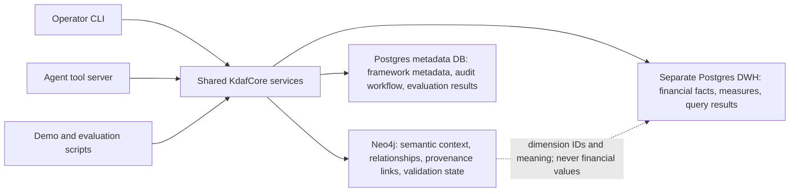

# KDAF v0.6 Architecture

KDAF separates semantic meaning, workflow metadata, and financial measures. Every public surface
calls shared `KdafCore` services, so the CLI, JSON-line tool server, and scripts apply the same
validation, provenance, evaluation, and error behavior.

The architecture operationalizes KDAF's
[six-stage knowledge-building approach](six-stage-approach.md), beginning with competency questions
and an MVG and ending with CARP retrieval, cited evidence, or an explicit refusal.

## Store ownership

| Store | Owns | Must not own |
| --- | --- | --- |
| Neo4j | Finance concepts, relationships, taxonomy, relevance context, provenance links, validation state, DWH dimension references | Amounts, balances, measures, fact rows, time-series financial values |
| Postgres metadata DB | Projects, runs, source registry, extraction workflow, validation decisions, audit events, evaluation and benchmark results | Financial fact rows |
| Separate Postgres DWH | Accounts, entities, departments, periods, scenarios, financial facts, controlled query results | Semantic graph relationships or framework audit workflow |

The dependency-free quickstart uses distinct SQLite adapters for metadata, DWH facts, and graph
provenance while preserving the same ownership boundaries. Production graph retrieval uses Neo4j;
the production read-only DWH query adapter uses Postgres. Current adapter coverage and limitations
are listed in the [readiness report](release-readiness-v0.6.md).

## Grounded-answer and evaluation flow

1. A project stores competency questions and an MVG in metadata.
2. CARP retrieves semantic concepts, relationships, provenance links, and validation state from
   Neo4j or the explicit offline semantic seed.
3. An allow-listed, read-only query retrieves financial facts from the separate DWH.
4. KDAF combines those references in an evidence packet with addressable entry IDs.
5. Answer generation accepts only citations to packet entries; invalid or unsupported output is
   replaced with an insufficient-evidence response.
6. Metadata audit events record query fingerprints, packet IDs, prompts, provider/model settings,
   outputs, statuses, and evaluation grades.

Financial facts can appear in a DWH-backed evidence packet and in an auditable cited answer. They
are never written to Neo4j. Evaluation metadata stores identifiers, statuses, and grades rather than
copying DWH rows.

## Public interfaces and errors

The public interfaces are:

- Python: `KdafCore`
- operator: `kdaf`
- agent: `kdaf-tool-server`
- adoption scripts: `scripts/run_public_demo.py` and `scripts/run_starter_kit_demo.py`

Success payloads are JSON objects. CLI/script failures and tool-server failures use a stable error
body containing `code` and `message`. A malformed tool request does not stop the long-running server,
and sanitized errors do not expose credentials, connection strings, or stack traces.

Detailed contracts:

- [Core API](core-api-contract-v0.2.md)
- [Extraction, provenance, and validation](provenance-validation-contract-v0.4.md)
- [CARP, DWH retrieval, evidence, and grounded answers](carp-retrieval-contract-v0.5.md)
- [FP&A benchmark](fpna-benchmark-v0.6.md)
