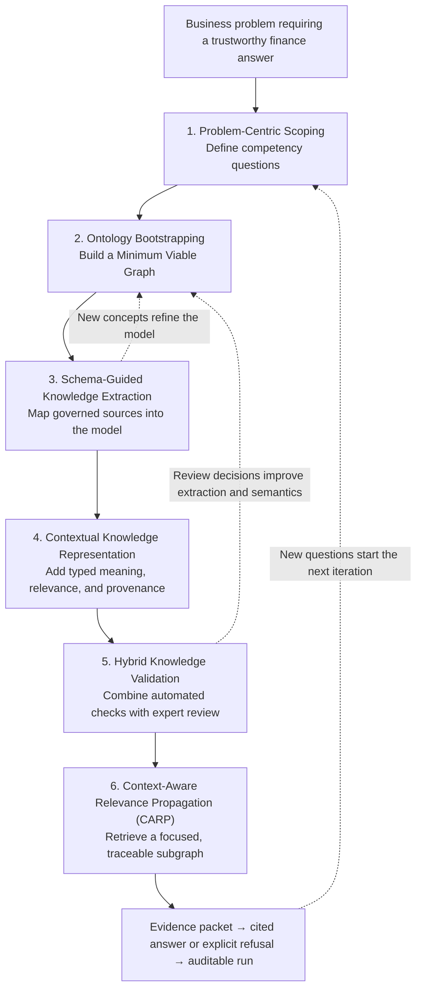

# Why KDAF Uses a Six-Stage Approach

Finance teams do not mainly struggle because language models cannot produce fluent answers. They
struggle because an answer used for planning, variance analysis, or management decisions must be
connected to authoritative numbers, interpreted through shared business definitions, and
reconstructable after the fact. Enterprise evidence is split across warehouse facts, reports,
commentary, policies, and expert knowledge. A schema can locate a field, and a flat retriever can
rank a passage, but neither alone explains why evidence matters, how it relates to the question, or
whether a responsible reviewer has accepted it.

KDAF addresses that trust gap by treating auditability as a property of the full knowledge-building
process. The framework starts with the decision that must be supported, builds only the semantic
structure needed for that decision, governs how evidence enters the system, and retrieves a focused
context whose facts, relationships, validation state, and provenance can be inspected. The result is
not merely an answer: it is an evidence packet and audit trail that a finance professional can
review, challenge, and reproduce.

## The six-stage knowledge-building loop

The stages are sequential enough to provide control, but iterative enough to evolve with new
questions, sources, concepts, and review decisions. The aim is not to build a comprehensive finance
ontology before delivering value. It is to grow a governed knowledge system from a small,
business-aligned scaffold.

## What each stage accomplishes

### 1. Problem-Centric Scoping

Start with a business decision or analytical problem, not with the available tables. Convert the
problem into competency questions such as “Which cost drivers explain the variance versus plan?”
These questions define what the knowledge system must be able to answer and prevent technically
complete but operationally irrelevant modeling.

Output: a bounded set of competency questions, business context, and success criteria.

### 2. Ontology Bootstrapping

Decompose the questions into the smallest useful set of entities, metrics, dimensions, scenarios,
and relationships. This Minimum Viable Graph (MVG) is the initial semantic scaffold. Domain experts
can review it before the organization invests in a broad ontology, reducing the cold-start cost of
knowledge modeling.

Output: an MVG that connects each question to the concepts and DWH dependencies needed to answer it.

### 3. Schema-Guided Knowledge Extraction

Use the MVG as a constraint when bringing governed source material into the system. Extraction
should map source content to known classes and relationships rather than creating an unconstrained
collection of entities. Newly discovered concepts can be proposed as controlled changes to the MVG
instead of silently changing the model.

Output: structured facts or source references with extraction metadata and provenance.

### 4. Contextual Knowledge Representation

Represent more than the existence of an entity or edge. Record what a relationship means, why it is
relevant, how confident the system is, where it came from, and how it connects to DWH dimensions.
This is what turns a graph traversal into an explanation a reviewer can inspect. Financial amounts
remain in the separate DWH; Neo4j stores semantic context and links.

Output: typed semantic relationships, relevance context, DWH references, and traversable source
lineage.

### 5. Hybrid Knowledge Validation

Apply automated consistency checks and route ambiguous or low-confidence knowledge to a qualified
reviewer. Approval, rejection, comments, and requested changes become durable workflow state rather
than informal corrections outside the system. Review feedback can refine both extraction and the
semantic model.

Output: explicit validation state and a timestamped decision history.

### 6. Context-Aware Relevance Propagation (CARP)

Identify concepts relevant to the question, traverse relationship types according to their
contextual importance, and stop when additional context is no longer sufficiently relevant. CARP
returns a focused semantic subgraph rather than an unbounded neighborhood. KDAF combines that
semantic context with controlled read-only DWH results to build an evidence packet for answer
generation and evaluation.

Output: a traceable retrieval context, evidence packet, cited answer or explicit refusal, and an
auditable run record.

## How the public framework implements the approach

| Stage | Current KDAF implementation | Coverage in v0.6 |
| --- | --- | --- |
| Problem-Centric Scoping | Project competency-question metadata and the starter FP&A question catalog | Implemented |
| Ontology Bootstrapping | MVG artifacts, starter concepts, and Neo4j semantic graph loading | Implemented |
| Schema-Guided Knowledge Extraction | CSV source registry, controlled extraction, separate DWH loading, and cross-store provenance | Partial: generalized schema-guided LLM extraction from heterogeneous documents is not yet provided |
| Contextual Knowledge Representation | Neo4j concepts and relationships, DWH dimension references, provenance links, and validation state | Implemented foundation; richer contextual relevance types remain extensible |
| Hybrid Knowledge Validation | Validation queue, comments, approval/rejection transitions, reviewer identity, and decision history | Implemented |
| CARP | Semantic retrieval, read-only DWH queries, evidence packets, citation validation, refusal behavior, and evaluation | Implemented for the public starter domain |

All operator and agent interfaces call shared core services. Neo4j owns semantic meaning,
relationships, provenance links, and validation context; the metadata database owns framework and
audit workflow state; the separate DWH owns financial numbers and facts. This separation is what
allows others to apply the methodology to their own finance questions without sacrificing the
controls required for trustworthy use.

## A practical variance-analysis example

Suppose leadership asks, “Which cost drivers explain the variance versus plan this quarter?”

1. The question becomes a competency question with an explicit decision context.
2. The MVG identifies concepts such as period, actual, plan, variance, account, department, and cost
   driver.
3. Governed sources are mapped to those concepts while numeric facts are loaded into the DWH.
4. Semantic relationships explain aggregation, attribution, and source lineage.
5. A controller reviews uncertain mappings or extracted relationships.
6. CARP retrieves only the relevant semantic context; a read-only DWH query supplies the amounts;
   the evidence packet supports a cited answer—or a refusal when the requested claim is unsupported.

This example captures the framework’s purpose: help practitioners move from a real finance problem
to an answer that is useful for decisions and still reviewable by the people accountable for its
data, definitions, and controls.

## Current boundary

KDAF provides a practical, local-first implementation and adoption evidence for this approach. It
does not make weak source data correct, eliminate the need for domain experts, or turn a citation
into proof of analytical correctness. Production adopters must still supply organization-specific
ontology content, governed data, identity and authorization, monitoring, retention, and operational
controls. See the [v0.6 readiness report](release-readiness-v0.6.md) for the tested capabilities and
known limitations.
